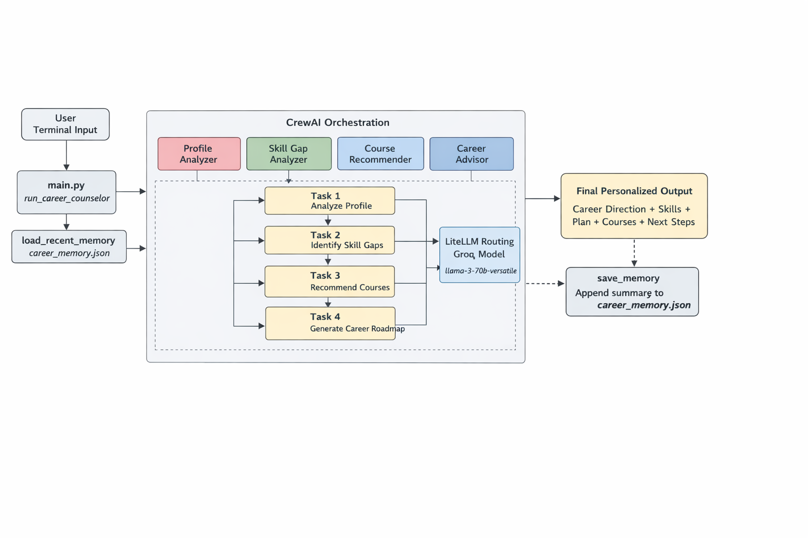

# AI Career Counselor (CrewAI Multi-Agent Project)

An AI-powered career counseling assistant built using a multi-agent workflow.

This project takes a user's profile (skills, background, interests), analyzes career fit, identifies skill gaps, recommends practical courses, and generates a personalized roadmap.

## What This Project Does

- Accepts a free-text profile input from the user.
- Runs a 4-agent collaboration pipeline:
	- Profile Analyzer
	- Skill Gap Analyzer
	- Course Recommender
	- Career Advisor
- Produces a clean final output with:
	- Career direction
	- Skills to focus on
	- 6-8 week learning plan
	- Course recommendations with reasons
	- Practical next steps and a project idea
- Stores lightweight memory from previous runs in a local JSON file.

## Tech Stack

- Python 3.x
- CrewAI
- LiteLLM (provider routing)
- Groq model (currently configured in code)
- python-dotenv (.env loading)

## Project Structure

- `main.py` - Entry point, crew orchestration, memory load/save, error handling
- `agents.py` - Agent roles, goals, backstories, and model configuration
- `tasks.py` - Task prompts and task-to-task context chaining
- `requirements.txt` - Python dependencies
- `career_memory.json` - Auto-generated local memory store (created after running)

## How It Works

1. User enters a profile in terminal.
2. `main.py` loads recent memory context (if available).
3. Task flow runs sequentially with context passing:
	 - Task 1 output -> Task 2 input context
	 - Task 2 output -> Task 3 input context
	 - Tasks 1+2+3 output -> Task 4 final response
4. Final output is printed.
5. A compact summary of the run is saved to `career_memory.json`.
## Architecture Diagram



## Setup

### 1. Clone and enter project

```bash
git clone <your-repo-url>
cd ai-career-counselor
```

### 2. Create and activate virtual environment

Windows (PowerShell):

```powershell
python -m venv .venv
.\.venv\Scripts\Activate.ps1
```

### 3. Install dependencies

```bash
pip install -r requirements.txt
```

### 4. Create `.env`

Add your Groq API key:

```env
GROQ_API_KEY=your_groq_api_key_here
```

## Run

```bash
python main.py
```

Then enter your profile when prompted.

## Current LLM Configuration

In `agents.py`, the model is configured as:

`groq/llama-3.3-70b-versatile`

You can change it by editing `llm` in `agents.py`.

## Output Style

The final response is designed to be demo-friendly:

- Personalized and professional tone
- Insight summary at the top
- Clear sectioned guidance
- Practical, actionable recommendations

## Memory

The app keeps simple persistent memory in `career_memory.json`:

- Stores timestamp
- Stores user input
- Stores a short output summary
- Retains latest entries (rolling window)

This helps future runs include context from prior interactions.

## Error Handling Included

`main.py` includes user-friendly handling for common provider issues:

- Invalid API key
- Quota exceeded
- Deprecated model

## Troubleshooting

- `invalid_api_key`
	- Verify `GROQ_API_KEY` in `.env`.

- `insufficient_quota` / `429`
	- Check provider billing/quota.

- `model_decommissioned`
	- Update model name in `agents.py`.

- `Could not find platform independent libraries <prefix>`
	- Usually an environment warning and may not block execution.

## Notes

- Do not hardcode API keys in source files.
- Keep `.env` private and excluded from version control.

## Future Improvements

- Add web UI (Streamlit/Gradio)
- Export roadmap to PDF/Markdown
- Add role-specific tracks (AI Engineer, Data Analyst, Full Stack)
- Add tests for task prompt quality and output schema

